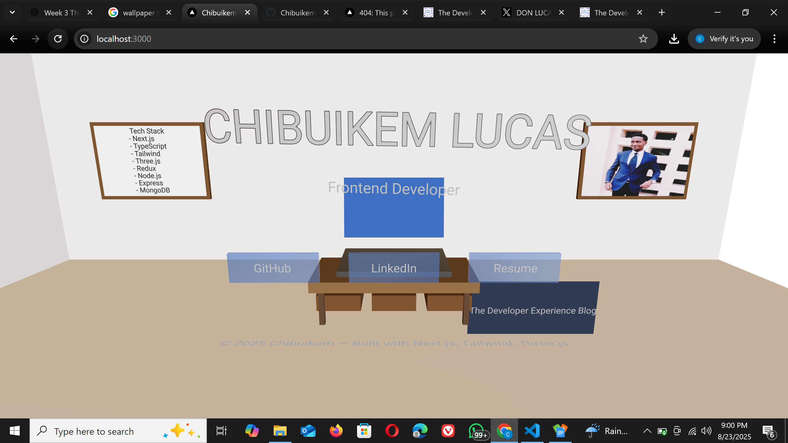

# 🚀 3D Portfolio — Built with Next.js, TypeScript, and Three.js  

This is my interactive **3D developer portfolio**, designed like a virtual office where you can explore my projects, tech stack, blog, and resume in an immersive environment powered by **Next.js (App Router)**, **React Three Fiber**, and **TypeScript**.  

## ✨ Features  
- 🌌 Fully interactive 3D environment with `@react-three/fiber` & `@react-three/drei`  
- 🖼️ **Framed wallpapers** for tech stack and profile picture  
- 💻 Laptop on desk linking to my work  
- 📝 Blog panel integrated with my Hashnode blog  
- 📄 Resume panel for quick access  
- 📱 **Mobile responsive** and optimized for performance  
- 🌍 Deployed with Vercel  

## 🛠️ Tech Stack  
- [Next.js 14 (App Router)](https://nextjs.org)  
- [React Three Fiber](https://docs.pmnd.rs/react-three-fiber/getting-started/introduction)  
- [Drei](https://github.com/pmndrs/drei)  
- [Three.js](https://threejs.org/)  
- [TailwindCSS](https://tailwindcss.com)  
- [TypeScript](https://www.typescriptlang.org)  

## 📂 Projects Displayed  
- **Crypto Tracker** → Realtime prices, charts, and alerts  
- **Interactive Resume** → Built directly into the 3D portfolio  
- More projects will be added as I build them 🚧  

## 🌍 Live Demo  
Check out the live portfolio here:  
👉 [three-portfolio-sandy.vercel.app](https://three-portfolio-sandy.vercel.app)  

My blog:  
👉 [The Developer Experience](https://the-developer-experience.hashnode.dev)  

## 📸 Preview


## 🚀 Getting Started  

Clone and run locally:  

```bash
git clone https://github.com/ChibuikemLucas/three-portfolio.git
cd three-portfolio
pnpm install
pnpm dev
